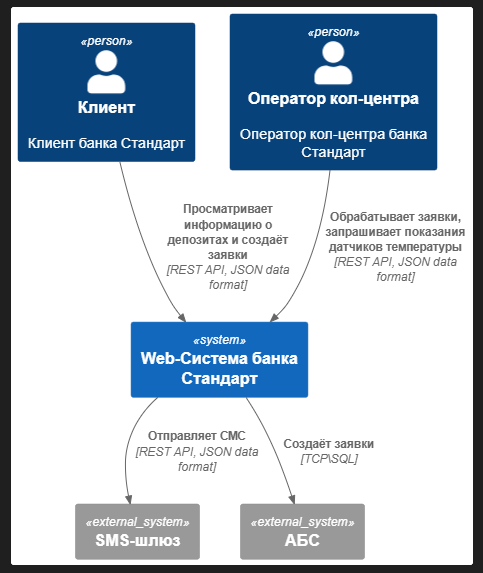
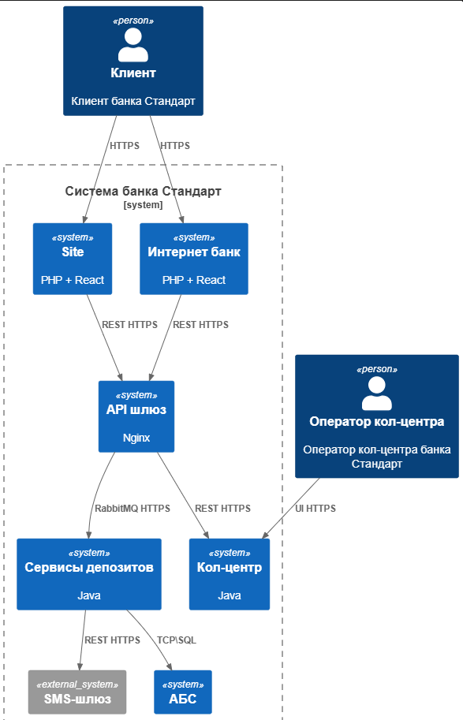

### **Название задачи:** 
### **Автор:**
### **Дата:**
### **Функциональные требования**
Опишите здесь верхнеуровневые Use Cases. Их нужно оформить в виде таблицы с пошаговым описанием:

|**№**|**Действующие лица или системы**|**Use Case**|**Описание**|
| :-: | :- | :- | :- |
| UC1 | Неавторизованный клиент | Просмотр каталога депозитов | Каталог на Web-сайте |
| UC2 | Неавторизованный клиент | Заявка на депозит | Заполнение WEb формы ФИО и номер телефона |
| UC3 | Менеджер кол-центра | Звонок клиенту, для верификации | Уточнение данных для идентификации и персональных предложений |
| UC4 | Верифицированный клиент | Подать заявку на депозит | Счет и сумма|
| UC5 | Менеджер бэк-офиса | Расчёт персональной ставки для клиента | На основе XLS данных отдела кредитования |
| UC6 | Менеджер бэк-офиса | Обработка заявки на создание депозита | Заведение депозита в ABS |
| ГС7 | ABS | СМС-код для заявки\информирования о депозите | СМС для обработки заявки |

### **Нефункциональные требования**
Опишите здесь нефункциональные требования и архитектурно значимые требования.

|**№**|**Требование**|
| :-: | :- |
| UR1 | Доступность 24*7 и аптайм R1, R2 |
| UR2 | 2 ЦОД. Репликация данных, общий шлюз с возможностью ручного переключения. R1, R2 |
| UR3 | Автоматизированные обновления. Docker, Kubernetes-helm  R2, S3 |
| UR4 | Swagger документация и API для тестирования S1 |
| UR5 | UML C4-диаграммы архитектуры приложения и детализация новых сервисов S2 |
| UR6 | CI\CD, Автотесты S3, R1, R2  |
| UR7 | Шифрование TLS 1.2+ R2, P1 |
| UR8 | .Net 4.5, MsSQL, Oracle PL\SQL, PHP, Java +R1 |

### **Решение**
Приведите диаграммы контекста и контейнеров в модели C4. Опишите там основные компоненты и интеграции всех элементов решения. 
[C4_Сontext.puml](C4_Сontext.puml)

[C4_container.puml](C4_Сontext.puml)

Также опишите, какой логикой вы руководствовались в ходе принятия решений и выбора технологий. Не забывайте, что необходимо учесть все функциональные и нефункциональные требования.

Везде используем HTTPS - UR7
Используем RabbitMq для работы с микросервисами депозитов - UR8, UR1
Сервисы депозитов - набор микросервисов. Требования UR3.
API шлюз для отказоустойчивости, кэширования и балансировки. UR2, UR1, UR3, UR6
Обращения в БД ABS - изоляция новый сервисов от старого решения, возможность переиспользовать функционал PL\SQL для MVP.

### **Альтернативы**
Обращаться в АБС приложение вместо БД. Есть риск перегрузки приложения и медленных ответов. Появляется зависимость от работы приложения АБС (например, во время обновления монолита).
Выгружать данные из АБС для расчёта депозитов из АБС в микросервисы заранее и синхронизировать периодически. Тогда расчёт депозита можно сделать независимо от АБС, но появятся затраты на синхронизацию данных и реализацию (дублирование) логики АБС для расчёта персональных депозитов. В рамках MVP может быть долгим.

**Недостатки, ограничения, риски**

RabbitMQ как быстрое решение для MVP - в будущем потребуются затраты на миграцию в Kafka.
АБС монолитен и расширяется только вертикально. При увеличении кол-ва заявок он станет бутылочным горлышком. Необходимо выносить по-возможности функционал из него и снижать зависимости.
Низкие компетенции: хоть в новых приложениях и используются приложения на привычных для уже имеющихся команд технологиях, но появляются и новые - Очереди сообщений, контейнеры и CI\CD пайплайны потребуют новых знаний, что может привести к риску ошибок и инфраструктурным отказам при введении решения в эксплуатацию.
Часть функционала обрабатывается вручную. Если пользователи будут подавать по 100 заявок в секунду, то очень быстро узким звеном окажется именно ручная обработка заявок и обзвоны.

