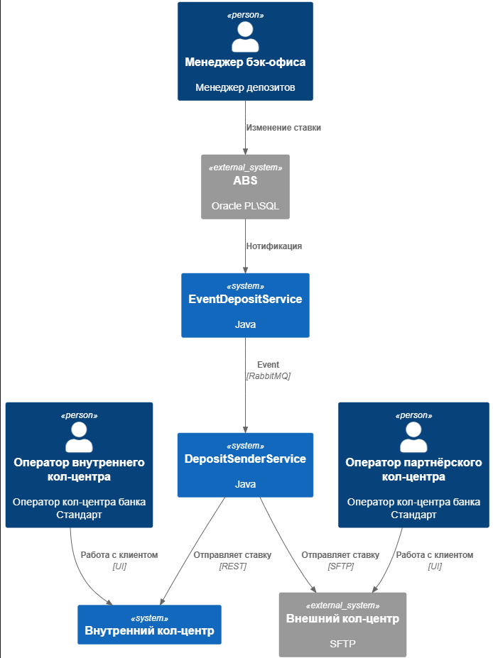
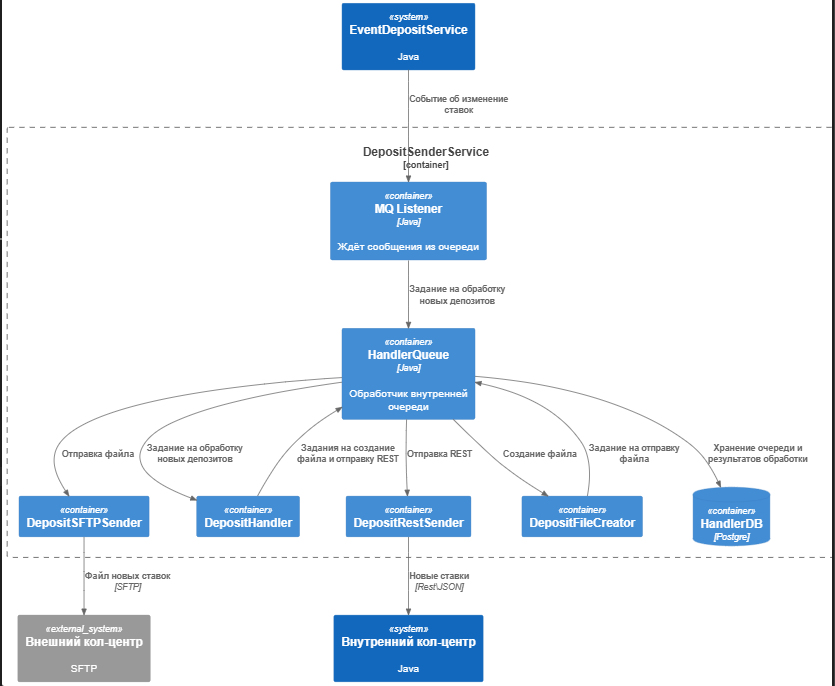

### <a name="_b7urdng99y53">Передача актуальных ставок по депозитам в кол-центр в формате MVP</a>**Название задачи:** 
### <a name="_hjk0fkfyohdk">Ведущий разработчик Майстер Алексей</a>**Автор:**
### <a name="_uanumrh8zrui">10.07.2025</a>**Дата:**
### **Функциональные требования**
Опишите здесь верхнеуровневые Use Cases. Их нужно оформить в виде таблицы с пошаговым описанием:

|**№**|**Действующие лица или системы**|**Use Case**|**Описание**|
| :-: | :- | :- | :- |
| UC1 | Менеджер бэк офиса | Ведёт каталог ставок | Вносит изменения в ставки |
| UC2 | EventDeposit-сервис | Получает\вычисляет событие об изменение ставки | Создаёт задание\событие для формирования файла |
| UC3 | DepositSender-сервис | Получает\слушает события об изменении ставок. Генерирует отправку во внутренний и внешний кол-центры | Во внутренний по API, во внешний файл |
| UC4 | Внутренний кол-центр | Принимает запрос со ставками, обновляет данные в приложении для сотрудников | Вносит изменения в ставки |
| UC5 | Партнёрский кол-центр | Принимает файл со ставками, обновляет данные в приложении для сотрудников | Вносит изменения в ставки |

### **Нефункциональные требования**
Опишите здесь нефункциональные требования и архитектурно значимые требования.

|**№**|**Требование**|
| :-: | :- |
| UR1 | Партнёрский кол-центр не может принять файл, через API-вызовы |
| UR2 | Партнёрский кол-центр находится во внешнем сегменте сети, SSL\TLS шифрование |
| UR3 | Доставка новых ставок до кол-центров в течение 60с |
| UR4 | В случае недоставки (ошибки сети, таймауты), ретраи 3 раза и запись в журнал |

### **Решение**
Приведите диаграммы контекста и контейнеров в модели C4. Опишите там основные компоненты и интеграции всех элементов решения. 

[C4_Сontext.puml](C4_Сontext.puml)

[C4_container.puml](C4_Сontext.puml)

Также опишите, какой логикой вы руководствовались в ходе принятия решений и выбора технологий. Не забывайте, что необходимо учесть все функциональные и нефункциональные требования.

Система разбита на небольшие слабо-зависимые микросервисы.
Если в процессе реализации, какое-то решение окажется неподходящим, то достаточно будет изменить один микросервис, не меняя всё остальное.
Сервис обработки и отправки можно реализовать как цельное приложение, или же разбить на несколько сервисов. Например, если генерация файлов работает медленно - её можно реализовать отдельным микросервисом, а остальное совместить в один на этапе MVP.

### **Альтернативы**
Опишите здесь наиболее важные альтернативные решения.

Передавать события из ABS об изменении ставок можно различными способами:
    REST запросами из ABS в EventService
    Вместо EventService использовать Kafka - и передавать запросы из ABS в ней
    В ABS Oracle сделать View возвращаю последние изменённые депозиты. EventDepositService должен хранить дату последнего изменения и если во View есть записи более свежие, то формировать для них событие в DepositService.

**Недостатки, ограничения, риски**

Если Event-service по какой-то причине не получит событие из ABS, то данные могут не дойти до кол-центров.
Наличие двух разных кол-центров и разных алгоритмов по доставке - риск несоответствия данных в результате ошибок или сетевых проблем. Не предусмотрен механизм по синхронизации с кол-центрами, если будет временная недоступность - Колцентр подрядчика находится во внешнем сегменте и мы не может гарантировать аптайм его сервисов.

